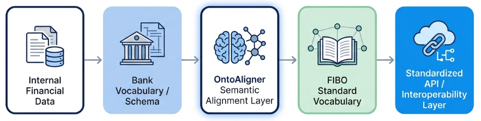
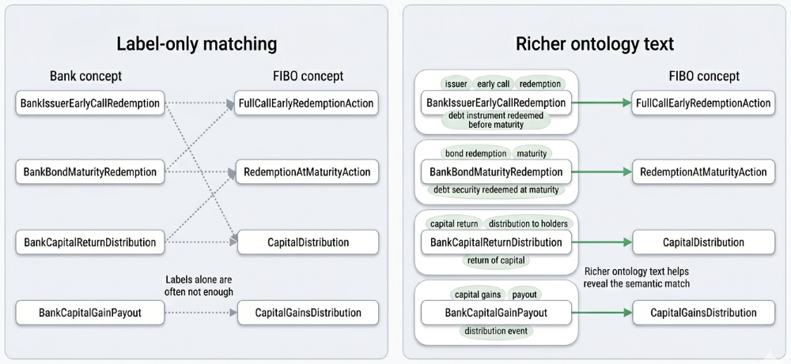
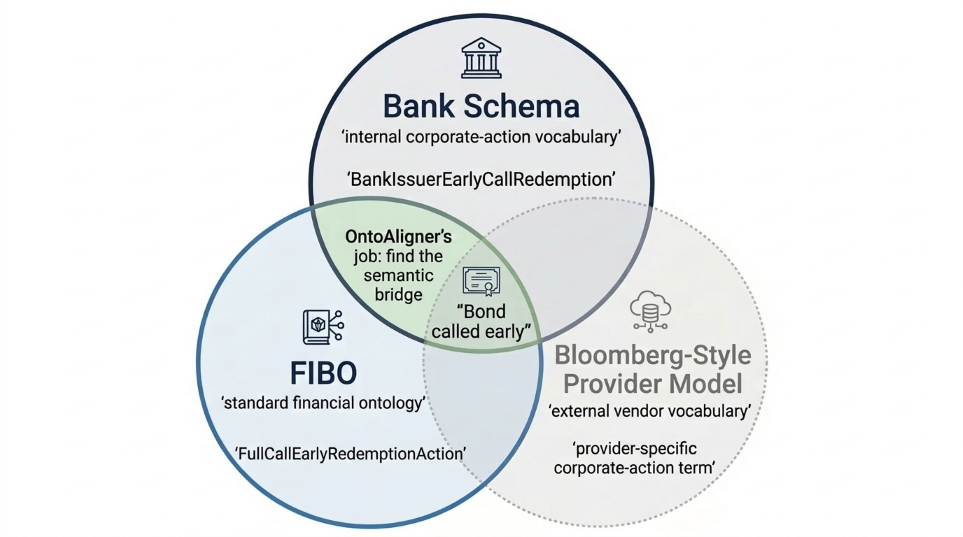

Financial Corporate Actions
===========================

.. hint::

        **We are using a synthetic bank ontology within this tutorial.**

.. sidebar:: 📓 Complete Notebook

    `financial_corporate_actions_alignment.ipynb <https://github.com/sciknoworg/OntoAligner/blob/dev/examples/usecase/financial_corporate_actions_alignment.ipynb>`_

This tutorial explains how to align a synthetic bank-style corporate-actions ontology with a FIBO corporate-actions ontology subset using OntoAligner. The workflow uses OLaLa parsing and encoding, SBERT-based retrieval, cross-encoder reranking, postprocessing, evaluation, and export.

**Objective**: Financial institutions often maintain internal vocabularies for corporate actions such as dividends, stock splits, redemptions, trading halts, issuer calls, and dividend reinvestment plans. These local names work inside the organization, but they can be difficult to connect to external standards such as FIBO. Ontology alignment helps discover correspondences between internal bank concepts and standard FIBO concepts, enabling semantic interoperability across internal systems, API layers, regulatory reporting, and external data integrations.

The figure below shows the high-level story of the use case. OntoAligner acts as a semantic bridge between the bank vocabulary and the FIBO standard.

Overview
-----------------

In this demo, the source ontology is a small synthetic bank vocabulary that mirrors how a real bank might name corporate-action concepts. The target ontology is a selected FIBO corporate-actions subset.

The synthetic source is used only to make the example shareable and safe to publish. The same pipeline can be applied to a real internal schema once that schema is represented as an ontology or schema-derived vocabulary.

.. note::

    The demo assets are available in the OntoAligner repository under
    `assets/bank-fibo <https://github.com/sciknoworg/OntoAligner/tree/dev/assets/bank-fibo>`_.

The demo contains **32 source concepts**, **53 target concepts**, and **31 reference mappings**.

Some representative Bank-to-FIBO correspondences in the use case are:

.. list-table:: Sample Bank-to-FIBO Concepts
   :header-rows: 1

   * - Synthetic Bank Concept
     - FIBO Concept
     - Financial Meaning
   * - ``BankIssuerEarlyCallRedemption``
     - ``FullCallEarlyRedemptionAction``
     - Issuer calls a debt instrument before maturity
   * - ``BankBondMaturityRedemption``
     - ``RedemptionAtMaturityAction``
     - Bond is redeemed at maturity
   * - ``BankCapitalReturnDistribution``
     - ``CapitalDistribution``
     - Capital is distributed back to holders
   * - ``BankShareSplitAction``
     - ``StockSplit``
     - Shares are split according to a corporate action
   * - ``BankDividendReinvestmentPlan``
     - ``DividendReinvestmentAction``
     - Dividend proceeds are reinvested

Why Corporate Actions?
----------------------

Corporate actions are a useful financial pilot because the domain is compact enough to explain, but still rich enough to show the real alignment problem.

A simple label match is often not enough. A bank may use a compact internal name such as ``BankIssuerEarlyCallRedemption``, while FIBO may represent the same idea with a more formal redemption concept. The two names are related, but they are not identical strings.

This is why the pipeline uses OLaLa-style parsing and encoding. Instead of relying only on the class name, it uses richer ontology text such as comments, annotation text, URI fragments, and normalized terms.

Bridging Financial Vocabularies
------------------------------------------------

In financial data integration, the same real-world event may appear in several vocabularies:

- the bank's internal schema,
- a standard ontology such as FIBO,
- and an external provider model, such as a Bloomberg-style data vocabulary.

These representations are not necessarily wrong; they were simply designed for different systems and users. For this tutorial, the first bridge is the focus: aligning the internal bank vocabulary to FIBO.

Usage
-----

The code below follows the same flow as the notebook: load the demo setup, encode concepts, retrieve candidate matches, rerank the candidates, postprocess the mappings, evaluate both output modes, and export the results.

.. tab:: ⚙️ Setup

      We start by importing the OntoAligner components used in this notebook, then create the Bank-to-FIBO alignment task and load the source ontology, target ontology, and reference mappings.

      The reference mappings are not used to generate predictions. They are only used later to evaluate how well the generated Bank-to-FIBO mappings match the expected alignments.

      .. code-block:: python

          import json
          import torch

          from ontoaligner.encoder import OLaLaEncoder
          from ontoaligner.ontology import OLaLaOMDataset
          from ontoaligner.utils import metrics, xmlify
          from ontoaligner.aligner import CrossEncoderReranking
          from ontoaligner.aligner.olala import OLaLaSBERTRetrieval
          from ontoaligner.postprocess import retriever_postprocessor

          task = OLaLaOMDataset()

          dataset = task.collect(
              source_ontology_path="../../assets/bank-fibo/source_bank_corporate_actions.rdf",
              target_ontology_path="../../assets/bank-fibo/target_fibo_corporate_actions.rdf",
              reference_matching_path="../../assets/bank-fibo/reference_matchings.xml",
          )

          print("Number of Source Concepts:", len(dataset["source"]))
          print("Number of Target Concepts:", len(dataset["target"]))
          print("Number of Reference Matchings:", len(dataset["reference"]))

          device = "cuda" if torch.cuda.is_available() else "cpu"
          print("Runtime Device:", device)

      Sample output:

      .. code-block:: text

          Number of Source Concepts: 32
          Number of Target Concepts: 53
          Number of Reference Matchings: 31

.. tab:: 🧩 Encode

      After loading the ontologies, each concept is still an ontology concept record.

      The encoder turns those records into comparable text representations. For corporate actions, this matters because useful meaning may be found not only in the label, but also in comments, annotation text, URI fragments, and normalized terms.

      .. code-block:: python

          encoder_model = OLaLaEncoder()

          source_onto, target_onto = encoder_model(
              source=dataset["source"],
              target=dataset["target"],
          )

          print("Number of Encoded Source Concepts:", len(source_onto))
          print("Number of Encoded Target Concepts:", len(target_onto))

.. tab:: 🔎 Retrieve

      The retrieval step casts a wide net.

      For each bank concept, OntoAligner searches the FIBO vocabulary and returns several possible matches. At this stage, the goal is not to make the final decision yet; the goal is to make sure the correct FIBO concept is likely included in the shortlist.

      .. code-block:: python

          retriever = OLaLaSBERTRetrieval(
              device=device,
              top_k=10,
              both_directions=True,
              topk_per_resource=True,
          )

          retriever.load(path="multi-qa-mpnet-base-dot-v1")

          retrieval_outputs = retriever.generate(
              input_data=[source_onto, target_onto]
          )

          print("Number of Retrieved Source Groups:", len(retrieval_outputs))

      Sample retrieval output structure:

      .. code-block:: javascript

          [
            {
              "source": "https://example.org/bank/ontology/corporate-actions/BankTradingHaltMessage",
              "target-cands": [
                "https://spec.edmcouncil.org/fibo/ontology/CAE/CorporateEvents/SecurityRelatedCorporateActions/TradingStatusSuspendedMessage",
                "https://spec.edmcouncil.org/fibo/ontology/CAE/CorporateEvents/SecurityRelatedCorporateActions/TradingStatusMessage",
                "https://spec.edmcouncil.org/fibo/ontology/CAE/CorporateEvents/SecurityRelatedCorporateActions/TradingStatusActiveMessage"
              ],
              "score-cands": [...]
            }
          ]

.. tab:: 🎯 Rerank

      Retrieval gives us a useful shortlist, but not every candidate is equally strong.

      The reranker looks at each bank concept and candidate FIBO concept together, then reorders the candidates so the most semantically relevant ones rise to the top.

      .. code-block:: python

          reranker = CrossEncoderReranking(
              device=device,
              top_k=5,
              normalize_score="sigmoid",
          )

          reranker.load(path="cross-encoder/ms-marco-MiniLM-L6-v2")

          reranked_outputs = reranker.generate(
              input_data=[source_onto, target_onto, retrieval_outputs]
          )

          print("Number of Reranked Source Groups:", len(reranked_outputs))

.. tab:: 🧹 Postprocess

      The reranker still returns grouped candidates for each bank concept.

      The postprocessor turns those grouped candidate lists into flat source-target mappings. This is the point where reranked candidates become alignment outputs that can be evaluated, inspected, and exported.

      .. code-block:: python

          matchings = retriever_postprocessor(
              predicts=reranked_outputs,
              threshold=0.5,
          )

          print("Number of Final Matchings:", len(matchings))
          print("Sample Matchings:", json.dumps(matchings[:5], indent=4))

.. tab:: 📊 Evaluate

      The same pipeline can answer two different practical questions:

      - **Candidate discovery** asks: "show me everything that might match."
      - **Strict top-1 alignment** asks: "tell me the one strongest answer."

      Candidate discovery is useful when a data steward wants to inspect several plausible FIBO matches before approving a mapping. Strict top-1 alignment is cleaner for downstream use, such as an API portal, metadata catalog, or semantic data layer.

      .. image:: ../img/candidate_vs_final_alignment.png
         :alt: Candidate discovery versus final alignment
         :width: 100%

      Candidate discovery mode keeps all reranked candidates above the confidence threshold. This creates a review-friendly set of possible Bank-to-FIBO mappings before choosing a single final match.

      .. code-block:: python

          evaluation = metrics.evaluation_report(
              predicts=matchings,
              references=dataset["reference"],
          )

          print("Evaluation Report:", json.dumps(evaluation, indent=4))

      Candidate discovery recovered **30 of 31** intended mappings.

      .. list-table:: Candidate Discovery Evaluation
         :header-rows: 1

         * - Metric
           - Value
         * - Intersection
           - 30
         * - Precision
           - 41.10
         * - Recall
           - 96.77
         * - F-score
           - 57.69
         * - Predictions
           - 73
         * - References
           - 31

      The strict top-1 version keeps only the highest-ranked FIBO candidate for each bank concept. This produces a cleaner one-to-one alignment output for downstream use.

      .. code-block:: python

          strict_reranked_outputs = []

          for output in reranked_outputs:
              if not output["target-cands"]:
                  continue

              strict_reranked_outputs.append({
                  "source": output["source"],
                  "target-cands": output["target-cands"][:1],
                  "score-cands": output["score-cands"][:1],
              })

          strict_matchings = retriever_postprocessor(
              predicts=strict_reranked_outputs,
              threshold=0.5,
          )

          strict_evaluation = metrics.evaluation_report(
              predicts=strict_matchings,
              references=dataset["reference"],
          )

          print("Strict Top-1 Evaluation Report:", json.dumps(strict_evaluation, indent=4))

      Strict top-1 alignment recovered **27 of 31** intended mappings and achieved an **87.10% F-score**.

      .. list-table:: Strict Top-1 Evaluation
         :header-rows: 1

         * - Metric
           - Value
         * - Intersection
           - 27
         * - Precision
           - 87.10
         * - Recall
           - 87.10
         * - F-score
           - 87.10
         * - Predictions
           - 31
         * - References
           - 31

.. tab:: 📤 Export

      Once the mappings are generated, they need to be usable outside the notebook.

      The JSON outputs are useful for inspection, debugging, and application logic. The XML alignment outputs are useful for ontology-alignment workflows that expect a standard alignment file.

      .. code-block:: python

          xml_str = xmlify.xml_alignment_generator(matchings=matchings)

          with open("bank_fibo_reranked_matchings.xml", "w", encoding="utf-8") as xml_file:
              xml_file.write(xml_str)

          with open("bank_fibo_reranked_matchings.json", "w", encoding="utf-8") as json_file:
              json.dump(matchings, json_file, indent=4, ensure_ascii=False)

      The strict top-1 mappings can also be exported separately.

      .. code-block:: python

          strict_xml_str = xmlify.xml_alignment_generator(matchings=strict_matchings)

          with open("bank_fibo_strict_top1_matchings.xml", "w", encoding="utf-8") as xml_file:
              xml_file.write(strict_xml_str)

          with open("bank_fibo_strict_top1_matchings.json", "w", encoding="utf-8") as json_file:
              json.dump(strict_matchings, json_file, indent=4, ensure_ascii=False)

Summary
--------------------------

This demo shows how OntoAligner can support a practical financial semantic interoperability workflow. The bank keeps its own internal vocabulary, while OntoAligner helps connect that vocabulary to FIBO without requiring hand-written mapping rules.

The broader candidate-discovery mode recovered **30 out of 31** intended mappings, making it useful for human review. The stricter top-1 mode recovered **27 out of 31** mappings with an **87.10% F-score**, making it more suitable for downstream one-to-one mapping use cases.

The source ontology in this tutorial is synthetic, but the workflow is the important point. The same steps can be applied to a real bank schema once that vocabulary is represented as an ontology or schema-derived vocabulary.

The workflow also extends naturally to external provider vocabularies. A Bloomberg-style provider model can be aligned to FIBO in the same way, making FIBO the shared meeting point between internal bank systems and external financial data providers.